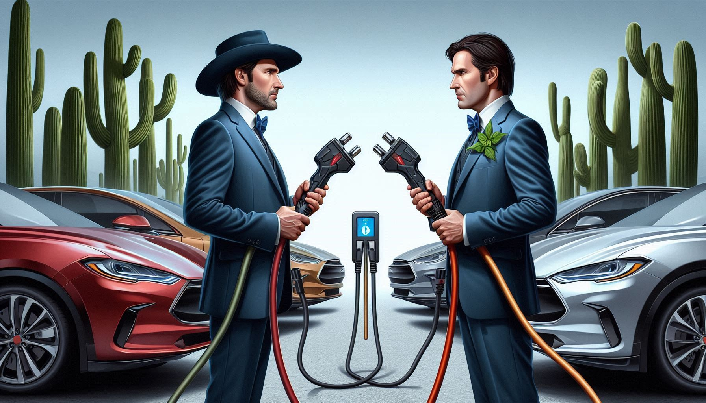

# O Bom, o Mau e o Feio: Regulamento da Mobilidade Elétrica em Portugal

Bem-vindo à wiki dedicada a explorar os prós, contras e soluções propostas para o regulamento da mobilidade elétrica em Portugal. 
Tentamos fornecer uma visão equilibrada e abrangente dos regulamentos de mobilidade elétrica em Portugal, destacando os aspetos positivos, desafios e limitações, bem como soluções propostas para melhorar a situação.

## Princípios

- **Utilizador**: As necessidades e experiências dos utilizadores de veículos elétricos são priorizadas.
- **Pragmatismo**: Não defendemos cegamente ideais, mas sim soluções práticas e realistas que alinhem os interesses dos utilizadores e agentes de mercado. Não sacrificamos o presente em nome de uma utopia.

## Explore as Secções
- **[O Bom](o-bom/introducao.md)**: Descubra os aspetos positivos do regulamento da mobilidade elétrica em Portugal.
- **[O Mau](o-mau/introducao.md)**: Conheça os desafios e limitações.
- **[O Feio](o-feio/introducao.md)**: Explore os aspetos controversos ou problemáticos.
- **[Soluções](solucoes/introducao.md)**: Veja ideias e recomendações para melhorar.

## Sobre a Wiki

Esta wiki é um projeto comunitário. Saiba mais sobre o seu propósito e como contribuir na página [Sobre](sobre.md).

## Recursos

Para leituras adicionais, consulte a página de [Recursos](recursos.md).

