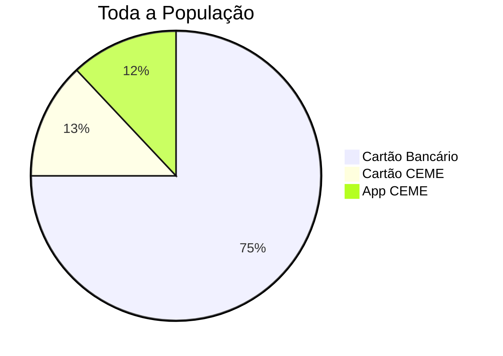
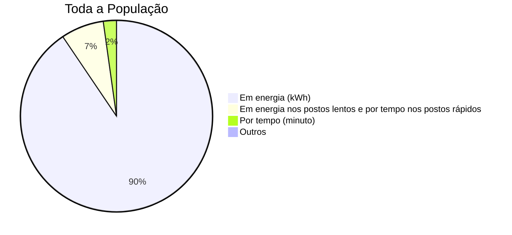
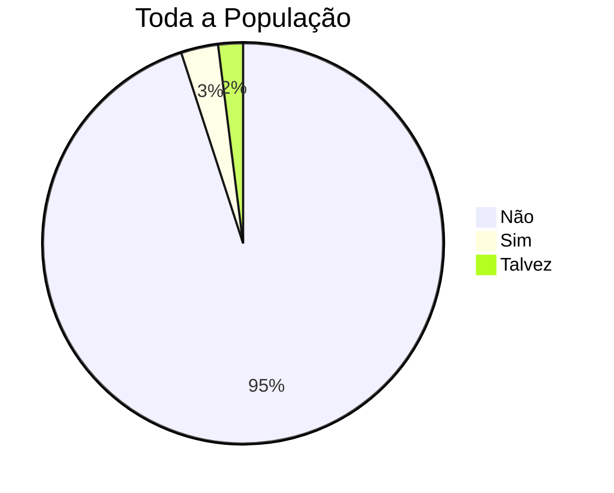
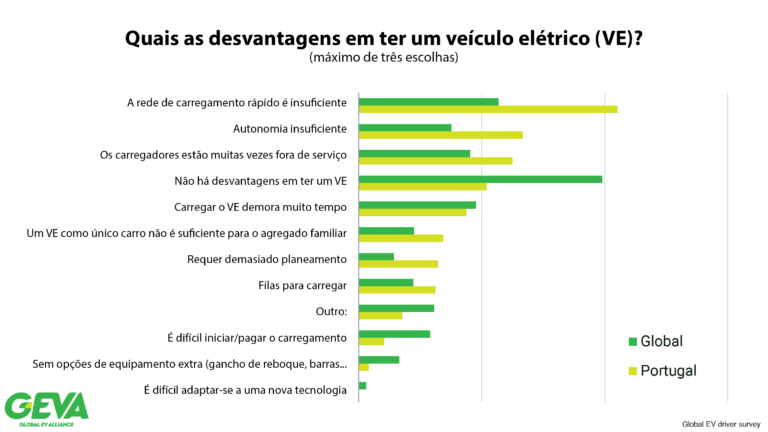
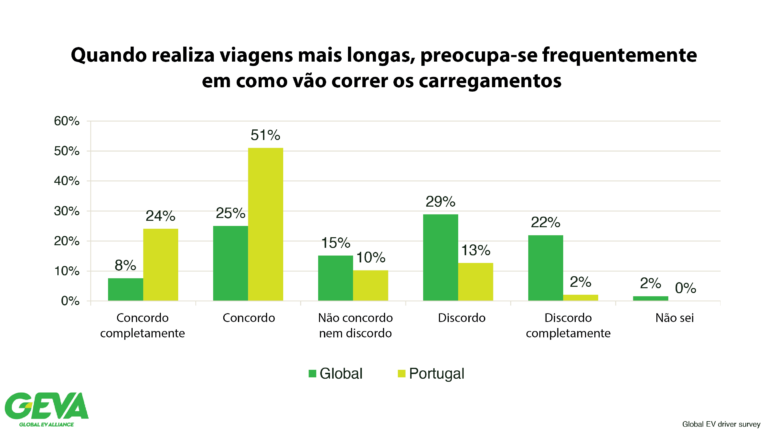
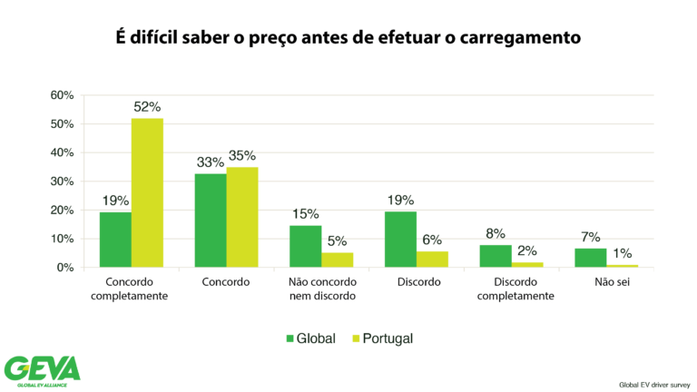
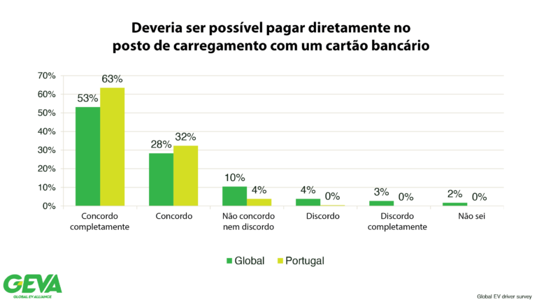
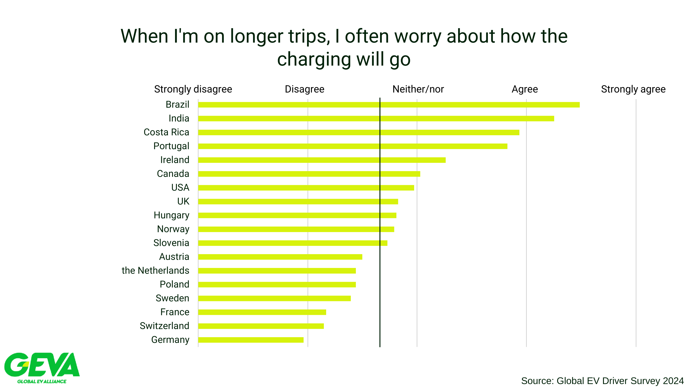
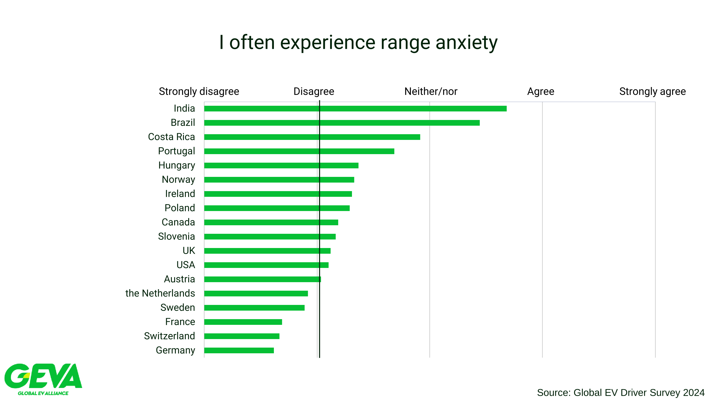
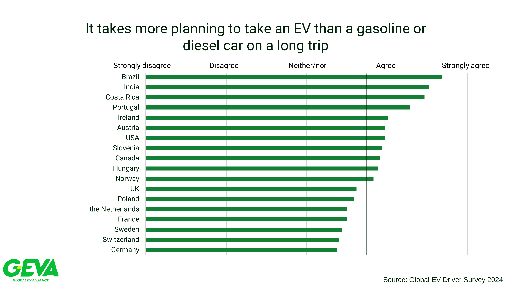

# Opinião Pública

Esta secção destaca as opiniões dos utilizadores sobre as suas experiências na rede pública de carregamento em Portugal.

Temos duas fontes de informação sobre a opinião pública:

1. Inquérito da AMME de 2024 aos utilizadores de veículos elétricos em Portugal.
2. Inquérito da GEVA de 2024 aos utilizadores de veículos elétricos em vários países do mundo, incluindo Portugal.

Ambos os inquéritos recolheram a opinião dos utilizadores sobre a rede de carregamento, sendo que o inquérito da GEVA permite a comparação com outros países.
Ambos os inquéritos demonstram que os utilizadores portugueses têm uma opinião negativa sobre a rede de carregamento em Portugal, apesar do modelo de mercado português permitir a interoperabilidade entre diferentes OPCs e CEMEs, e de existirem várias dezenas de CEME em Portugal e mais de uma centena de OPCs.

A AMME pretende demonstrar com estes resultados que uma experiência positiva para o utilizador não é garantida pela interoperabilidade permitida pela EGME. Existem outros fatores que influenciam a experiência do utilizador e que os agentes de mercado não têm tido a iniciativa de resolver, nomeadamente:

* **Previsibilidade de preços**: Os utilizadores têm dificuldade em prever o preço do carregamento;
* **Ativação com cartão bancário**: Ambos os inquéritos demonstram que mais de dois terços da população preferem uma solução de pagamento com cartão bancário, que os OPC têm tido dificuldade em implementar e que é obrigatório disponibilizar em todos os postos instalados a partir de abril de 2024;
* **Carregadores adequados às necessidades**:  Especialmente o inquérito da GEVA demonstra que os utilizadores portugueses têm mais dificuldade em encontrar postos disponíveis nos seus percursos, têm mais ansiedade com a autonomia e necessitam de mais planeamento para viagens longas do que a média global.

Praticamente todos os problemas apontados poderem ser resolvidos dentro do quadro legislativo atual e alterações menores. 
No entanto, o facto é que desde o início da fase comercial da rede pública em 2018, os agentes de mercado não têm tido a iniciativa de resolver estes problemas, o que tem levado a uma insatisfação crescente dos utilizadores com a rede de carregamento em Portugal. 
Por outro lado, os utilizadores inquiridos no estrangeiro têm uma opinião mais positiva sobre as suas redes de carregamento.

!!! question "O modelo português serve os utilizadores?"
    * O modelo de mercado português, com a separação entre o fornecimento de energia e o serviço de carregamento, tem servido os utilizadores de veículos elétricos em Portugal? 
    * Quem garante uma experiência positiva para o utilizador, quando o utilizador precisa de um serviço completo que é prestado por diferentes agentes de mercado com diferentes motivações?
    * Devemos continuar a investir num modelo de mercado que tem demonstrado não ser capaz de garantir uma experiência positiva para o utilizador?

## Inquérito AMME 2024

A AMME realizou um inquérito aos utilizadores de veículos elétricos em Portugal em 2024, com os seguintes objetivos:

* Perceber as preferências dos utilizadores de veículos eléctricos em relação ao carregamento fora de casa;
* Perceber a opinião dos utilizadores sobre a rede pública;
* Perceber como o que os utilizadores vêem o AFIR.

A divulgação do inquérito foi feito da seguinte forma:

* Questionário realizado online através do Google Forms;
* Enviado por e-mail para os subscritores de email da AMME;
* Partilhado em redes sociais em vários grupos ligados à mobilidade eléctrica com um pedido para o preenchimento do mesmo;
* Respostas colecionadas durante cerca de 2 semanas, começando a 24 de março de 2024.

Foram recolhidas 539 respostas válidas, que foram analisadas e resumidas no relatório final do inquérito.

Os resultados detalhados estão disponíveis [neste link](https://docs.google.com/presentation/d/1M_XecwvLMw-TJ6OtJXPXJ4uyTNahAE4HmuitQOkTvNg/edit?usp=sharing).

### Demografias

* **Experiência com VE**: 50% dos inquiridos afirmaram ter experiência com veículos eléctricos há mais de 3 anos ou mais.
* **Associados AMME**: 53% dos inquiridos afirmaram ser associados da AMME.
* **Utilizadores Intensivos**: 17% dos inquiridos afirmaram fazer mais de metade dos seus carregamentos em redes de acesso público.
* **Utilizadores MobiE**: 57% dos inquiridos afirmaram utilizar maioritariamente postos da rede MobiE.

### Preferências no Método de Pagamento

Os utilizadores de veículos eléctricos foram questionados sobre o seu método de ativação preferido nos postos de carregamento, entre as opções de **cartão bancário (previsto pelo AFIR)**, **cartão CEME** e **app CEME**.
No conjunto de todos os utilizadores, a preferência pelo cartão bancário é clara, com 75% dos inquiridos a preferirem este método, e os restantes 25% as soluções CEME.

!!! note "Segmentos de Utilizadores"
    A preferência pelo multibanco mantém-se muito significante em todos os segmentos de utilizadores; **71% dos não-associados da AMME**, **também 71% dos utilizadores intensivos da rede pública** e **68% dos utilizadores MobiE** preferem o multibanco.

### Preferências nas Tarifas de Operação (OPC)

Os utilizadores foram questionados sobre qual seria a sua **preferência na unidade de tarifação dos postos de carregamento**, entre as opções de energia, tempo ou misto. 
**A preferência pela tarifação por energia é clara, com 90% dos inquiridos a preferirem este método**, e os restantes 10% as soluções de tempo ou misto. 
Note-se que a solução proposta pela Associação UVE, de tarifação por unidade de energia durante X minutos e depois por tempo, foi a escolha de menos de 1% dos inquiridos. 
Note-se também que em janeiro de 2025, 97% das tomadas na rede pública têm pelo menos uma componente de tempo na tarifa, sendo que **apenas 3% vão de encontro às expectativas de 90% da população**.

!!! note "Segmentos de Utilizadores"
    A preferência pela tarifação por energia mantém-se muito significante em todos os segmentos de utilizadores; **89% dos não-associados da AMME**, **90% dos utilizadores intensivos da rede pública** e **88% dos utilizadores MobiE** preferem a tarifação exclusivamente por energia.

### Opinião sobre a Estrutura Tarifária

Os utilizadores foram questionados sobre a sua opinião sobre **se acham simples de entender a estrutura tarifária dos postos de carregamento**, composta por uma tarifa CEME e uma tarifa OPC apresentada no posto de carregamento ou numa aplicação. A opinião de **95% dos utilizadores é de que a estrutura tarifária imposta pelo método comum de pagamento é complexa e difícil de entender**.

!!! note "Segmentos de Utilizadores"
    A complexidade da estrutura tarifária do método comum de pagamento é também apontada de forma significativa por todos os segmentos da população; **93% dos não-associados da AMME**, **94% dos utilizadores intensivos da rede pública** e **93% dos utilizadores MobiE**.

### Outros Resultados

Outros resultados do inquérito incluem:

| Pergunta | População Geral | Não-Associados AMME | Utilizadores Intensivos | Utilizadores MobiE |
| --- | --- | --- | --- | --- |
| **% média de sessões iniciadas com sucesso** | 66.9 | 66.6 | 66.6 | 66.5 |
| **% de utilizadores que encontram frequentemente postos ocupados** | 65.5 | 62.9 | 71.3 | 64.7 |
| **% de utilizadores que valorizam a interoperabilidade em todos os postos** | 52.4 | 54.1 | 50.0 | 59.5 |

Em relação aos resultados apresentados na tabela anterior, destaca-se que:

* Os utilizadores têm em média problemas na ativação de 1 em cada 3 sessões de carregamento;
* Dois terços da população encontram frequentemente postos ocupados, e este valor é ainda mais elevado nos utilizadores intensivos da rede pública;
* Apenas metade dos utilizadores valorizam a interoperabilidade em todos os postos, sendo que este valor é mais elevado nos utilizadores MobiE.

Os resultados completos do inquérito estão disponíveis [neste link](https://docs.google.com/presentation/d/1M_XecwvLMw-TJ6OtJXPXJ4uyTNahAE4HmuitQOkTvNg/edit?usp=sharing).

## Inquérito GEVA 2024

A Associação UVE promoveu um inquérito da GEVA que recolheu em 2024 respostas de 258 utilizadores de veículos eléctricos em Portugal. 
Os resultados do inquérito foram publicados pela UVE em 2025 e estão disponíveis [neste link](https://www.uve.pt/page/inquerito-geva-2024-portugal/).
Este inquérito foi realizado em 18 países, o que o torna particularmente relevante para a comparação internacional.

Apontamos aqui alguns resultados do inquérito que consideramos relevantes para a discussão sobre a opinião pública em Portugal em relação à rede de carregamento.

### Adequação da Rede de Carregamento em Portugal

Os portugueses acham que a rede de carregamento é **insuficiente para as suas necessidades em muito maior proporção do que a média global**. Queixam-se também em maior proporção da autonomia dos veículos, da fiabilidade dos carregadores, filas de espera e excesso de necessidade de planeamento. Por outro lado, têm significativamente menos dificuldade a iniciar uma sessão de carregamento do que a média global.

Os portugueses também sentem maior ansiedade antes de uma viagem mais longa. **76% dos inquiridos portugueses concordam** ou concordam completamente com a afirmação *"Quando realiza viagens mais longas, preocupa-se frequentemente em como vão correr os carregamentos"*, enquanto que **a média global é de 33%**. 

Outras questões também refletem insatisfação com as opções de carregamento, onde os portugueses se destacam negativamente em relação à média global. Nomeadamente nas questões:
* "É necessário mais planeamento para as viagens longas com um Veículo Elétrico do que com um veículo a gasolina ou diesel";
* "Sente frequentemente ansiedade com a autonomia"

### Dificuldade em Prever o Preço do Carregamento

Os utilizadores portugueses têm significativamente mais dificuldade em prever o preço do carregamento do que a média global. 56% dos inquiridos portugueses concordam ou concordam completamente com a afirmação *"É difícil saber o preço antes de efetuar o carregamento"*, enquanto que a média global é de 19%.

No mesmo sentido, os portugueses sentem maior necessidade da opção de ativação do posto com cartão bancário, apesar de terem acesso a cartões CEME que são mais comuns em Portugal. 

### Comparação Com Outros Países

Os portugueses têm consistentemente uma opinião mais negativa sobre a rede de carregamento do que qualquer outro país europeu inquirido, sendo mais positivos apenas que os inquiridos do Brasil, Índia e Costa Rica. Isto verifica-se nas seguintes questões:

* *"Quando realiza viagens mais longas, preocupa-se frequentemente em como vão correr os carregamentos"*;
* *"Sente frequentemente ansiedade com a autonomia"*;
* *"É necessário mais planeamento para as viagens longas com um Veículo Elétrico do que com um veículo a gasolina ou diesel"*.

