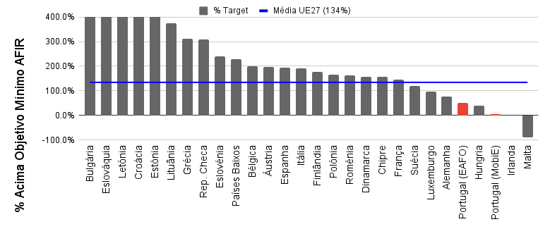
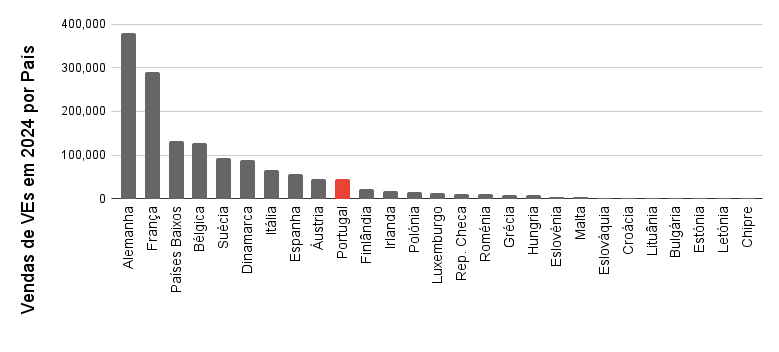

# Falta de Investimento na Infraestrutura de Acesso Público

## Os portugueses têm acesso a menos infraestrutura de carregamento do que quase todos os outros países da UE

Em Junho de 2024 a AMME [publicou os dados do EAFO disponíveis à data e relativos ao índice de disponibilidade da infraestrutura de carregamento](https://amme.com.pt/blogs/news/portugal-na-cauda-da-europa-em-infraestrutura-para-veiculos-eletricos).

Com os dados atuais podemos atualizar esta estatística. [O EAFO mantém o acompanhamento permanente destes dados](https://alternative-fuels-observatory.ec.europa.eu/transport-mode/road/european-union-eu27/target-tracker).

Sem surpresa, podemos concluir que a posição de Portugal neste ranking não se alterou:

!!! note "Nota"
    A média apresentada é a média ponderada, pesando o objetivo de cada país segundo a métrica imposta pelo AFIR.

!!! info inline end warning "A Mobi.E corrigiu sem aviso dados de potência disponível em Novembro"
    A Mobi.E corrigiu sem notificação os dados de potência disponível em Novembro, o que levou a uma alteração significativa na métrica-objetivo do AFIR. Esta correção levou a um aumento de 14MW de potência na rede (ou 4.6% do objetivo na mesma data) sem a adição de qualquer nova infraestrutura. Sem esta correção, Portugal teria terminado o ano com uma margem de 1.5% em relação ao objetivo mínimo.

São mostrados 2 conjuntos de dados relativos a Portugal (a vermelho), à esquerda são os dados do EAFO, à direita os dados comunicados pela Mobi.E. Tal como em Junho, verificam-se valores díspares entre o EAFO e a Mobi.E: o EAFO aponta uma disponibilidade de infraestrura de 50% acima do objetivo mínimo, enquanto que a Mobi.E aponta aponta apenas 5,6% acima desse objetivo. Esta diferença é justificada pelo objetivo manifestamente inferior no EAFO, bem como pela inclusão da disponibilidade da potência das redes de carregamento a operar à margem da EGME. Estes dados, mais uma vez, favorecem Portugal de forma fictícia.

O gráfico apresentado coloca nos lugares cimeiros países com uma taxa de penetração de veículos elétricos muito reduzida, o que facilita esta classificação. Para uma demonstração mais eficaz dos números podemos consultar o gráfico seguinte:

<iframe title="Infraestrutura disponível vs necessária" aria-label="Scatter Plot" id="datawrapper-chart-8otzE" src="https://datawrapper.dwcdn.net/8otzE/4/" scrolling="no" frameborder="0" style="width: 0; min-width: 100% !important; border: none;" height="572" data-external="1"></iframe>

Com esta ordenação dos países por objetivo de potência podemos avaliar facilmente o tamanho da frota de veículos elétricos em cada país em relação à percentagem da disponibilidade da infraestrutura de carregamento acima do mínimo definido pelo AFIR.
Em complemento ao tamanho da frota, os números de veículos elétricos vendidos por país na Europa no total de 2024 são:

Concluímos o ano com Portugal, sem surpresa, na cauda da Europa. Qualquer um dos países com boa penetração de VEs tem uma disponibilidade de potência totalmente invejável e mesmo Espanha, habitualmente utilizada como exemplo negativo, o “patinho feio da Mobilidade Elétrica”, tem agora cerca 4x a nossa potência disponível.

!!! note "Nota Técnica"
    A AMME extraiu do portal EAFO os dados referentes a 15 de janeiro de 2025, nomeadamente o objectivo em kW e a potência instalada em kW também, para cada um dos 27 países. Para calcular quanto cada país excede (ou não) o objectivo em percentagem basta determinar o quociente entre a potência instalada e o objectivo, e subtrair 100%. De seguida, ordenamos a percentagem em excesso por ordem decrescente para criar o gráfico mostrado de seguida.
    Os dados da Mobi.E foram obtidos do seu comunicado de imprensa de 13-01-2025.
    Os dados das vendas de VE na Europa foram obtidos da página da ACEA, retificados os dados para Portugal do site da ACAP. Apenas estão considerados veículos 100% elétricos.

